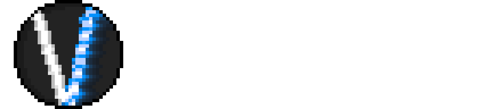

Volta is a WIP 2D game development framework for Luau written in C++. This is a passion project and one I'll use to learn more about C++, so expect the code to not be of the highest quality.

It is theoretically cross platform, but currently only officially supports Windows, Linux and macOS (though **macOS has no official builds**, so you will have to compile the framework yourself for it). Android and iOS support is planned in the future.

# Usage
You can run your game by running your luau script through the Volta executable like this: `volta main.luau` (where the filename can be anything other than main too)

Volta's documentation can be found [here](https://voltaframework.gitbook.io/volta)

# Why use Volta
There are so many frameworks and engines for various languages that it's sometimes hard to decide what tools to use to make your game. You could use Volta if, for example:
- You like the Luau language,
- You like writing games in Lua but find it a bit lacking as a language,
- You want to make a game in a simple framework with a simple language without much prior experience,
- You want an easily moddable game,
- You want your game to be possible to port to pretty much any platform (thanks to the C++ foundation),
- You want to do some fast prototyping.

# AI usage in the project
Used AI to write code sparingly - not to vibecode too much, just to assist with some tasks, explain some things, find bugs, etc.
The only parts of the project that used AI extensively were:
- the CMake configuration for building,
- the `require()` implementation,
- the coordinate system transformation functions,
- the parts of drawing functions that use transformed coordinate systems,
- vector2 functions other than vector2.create and the ones that are the same as the built-in vector's.
- the Animated Sprite and Color objects,
- shaders implementation,
- Box2D bindings.

Besides that only a little AI code here and there, sparingly.

# Building and dependencies
To build the framework yourself you need SDL3, SDL3_image, SDL3_mixer, SDL3_ttf and OpenSSL installed on your system.
Additionally, Luau has to be cloned into `dependencies/luau` (I'm currently developing the framework with Luau release 0.734).
`httplib.h` also has to be put into `dependencies/cpp-httplib` (currently using the header from release v0.52.0).

Specific OS notes are listed below.

## Linux
For building an AppImage on Linux, linuxdeploy is needed. You can build an AppImage with `cmake --build build --target appimage`. A regular `cmake --build build` will build an executable that **won't** have SDL3 and other dependencies bundled and it's overall not recommended.

## Windows
On Windows the SDL libraries are put as `.dll`s alongside the volta executable instead of everything being in a single executable like it is with AppImage on Linux. 

For cross compiling to Windows from Linux, there's a special cmake toolchain for Windows specifically in `cmake/toolchains/mingw-w64-x86_64.cmake`. Also, `SDL3-3.4.12`, `SDL3_image-3.4.4`, `SDL3_mixer-3.2.4` and `SDL3_ttf-3.2.2` must be present in `dependencies/win-libs`. These should be downloaded from the official SDL GitHub repositories (eg. Releases -> `SDL3-devel-3.4.12-mingw.zip`).

## macOS
I don't know man I don't even have a Mac. I think you should be able to build volta fine though?

# License
The Volta framework is licensed under the MIT license.
Licenses of all used and distributed alongside Volta libraries can be found in THIRD_PARTY_NOTICES.txt